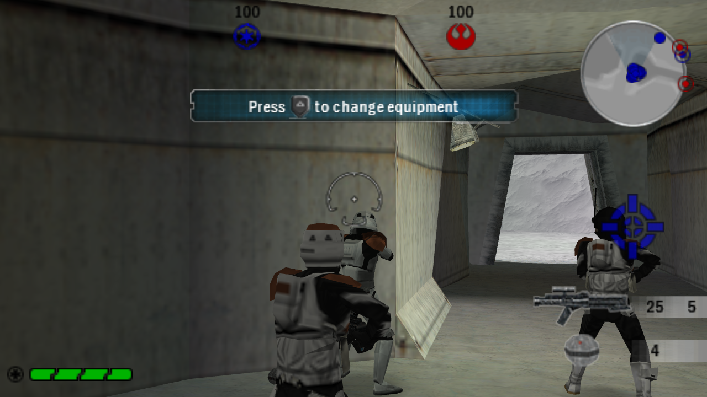
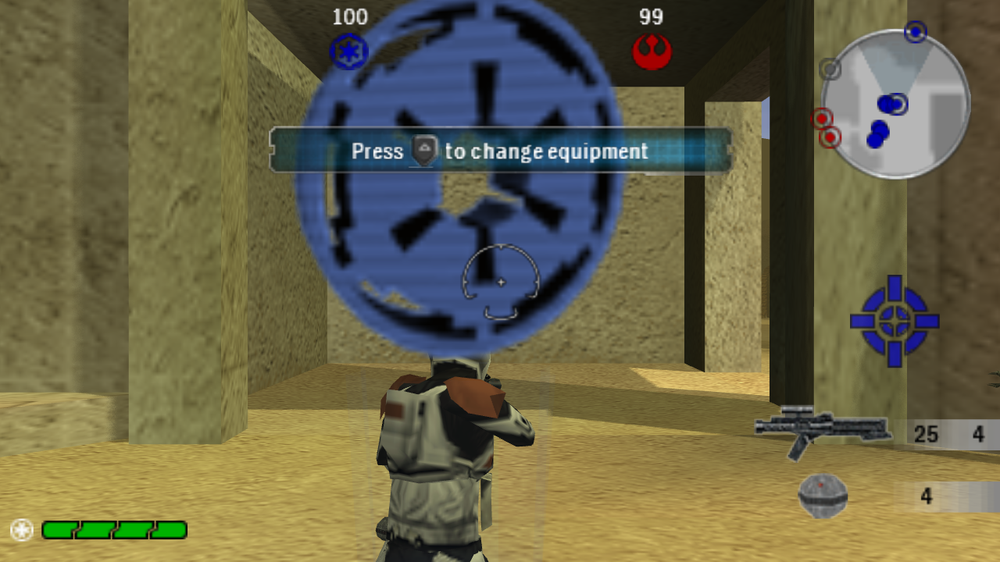
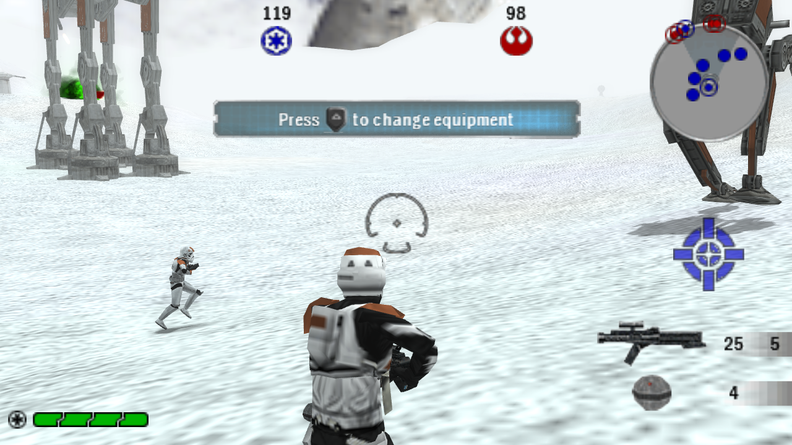
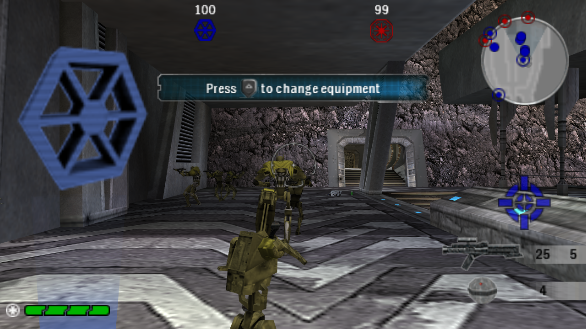
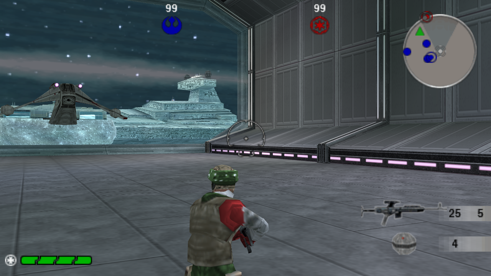

# Star Wars Battlefront: Renegade Squadron — PC

A native Windows port of the PSP game *Star Wars Battlefront: Renegade Squadron* (ULUS10292), made by
**static recompilation**: the game's PSP program is translated into C++ and compiled into a regular
Windows executable. There is no emulator. A native host layer replaces the PSP system services, and
the game is drawn with DirectX 12.

No game data is included. You need your own copy of the game.



| | |
|---|---|
|  |  |
|  |  |

## Status

Playable, with known issues.

- Boots through the menus into ground and space battles. Captures from recorded play cover 11 maps,
  including space battles.
- Runs at about 58 frames per second at 1280×720 on a Ryzen 7 8745HS with Radeon 780M graphics.
- DirectX 12 rendering with 4× MSAA, presented directly to the window.
- Game frame rate raised from the PSP's 20 fps to 60 fps.
- Per-pixel lighting, sun shadows and bloom (each can be switched off).
- Texture replacement packs, including normal maps (see [OVERRIDES.md](OVERRIDES.md) and
  [PC-MODE.md](PC-MODE.md)).
- Modern twin-stick controls with Xbox/XInput controllers (see [MODERN-CONTROLS.md](MODERN-CONTROLS.md)).

Known issues:

- The PSP on-screen keyboard is not implemented. Entering a profile name stops the game.
- Sun shadows darken some interiors that the game already lights as indoors. Use `-NoShadows` if this
  bothers you.
- Frame-to-frame timing is slightly uneven around 60 fps.

## Requirements

- Windows 10 or 11, 64-bit, with a DirectX 12 graphics card.
- Your own copy of the game: the US release, ULUS10292. The build checks `BOOT.BIN` against SHA-256
  `f4c7a9ef93475fc8017f649346ef79b599649dc47462ec419e9fd373146f8c68`.
- Visual Studio 2022 Community with the C++ workload (MSVC 14.44), installed at the default location.
- CMake 3.20 or newer, Ninja, and Python 3.10 or newer, on `PATH`.
- PowerShell 7 (`pwsh`) for the dependency script.

## Building

All commands run from the repository root.

1. **Extract the game.** Extract the ISO with 7-Zip or similar so that `work\game\disc\PSP_GAME\`
   exists (`work\game\disc\PSP_GAME\SYSDIR\BOOT.BIN` and `work\game\disc\PSP_GAME\USRDIR\`).

2. **Fetch SDL2 and FFmpeg.** The script downloads pinned releases, checks their SHA-256 hashes and
   lays them out in `work\windows-sdk`:

   ```
   pwsh work\restore-windows-dependencies.ps1
   ```

3. **Generate the translated game code** from your own `BOOT.BIN`. This builds the recompiler and writes
   the C++ translation to `work\project\source\profiles\renegade\generated` (it is not distributed):

   ```
   work\generate-perf.cmd
   ```

4. **Configure and build** the game. The first build compiles about 400 large translated files and can
   take an hour or more; later builds are incremental.

   ```
   work\configure-perf.cmd
   work\build-perf.cmd 8 RenegadeNative
   ```

   The number is how many files compile in parallel. Each one can use more than a gigabyte of memory;
   lower it on machines with less than 32 GB.

## Running

```
Play-RenegadeSquadronPC.cmd
```

The launcher checks the game files, sets up controller handling and starts the game in PC mode.
Options are documented in [PC-MODE.md](PC-MODE.md), for example:

```
powershell -File Play-RenegadeSquadronPC.ps1 -NoShadows -NoBloom
powershell -File Play-RenegadeSquadronPC.ps1 -Renderer Software
```

## Repository layout

```
Play-RenegadeSquadronPC.*   Launcher
work\project\source\        Recompiler framework, host layer and game profile (profiles\renegade)
work\project\tools\         Replay runner and helper scripts
work\*.cmd, work\*.ps1      Build and dependency scripts
docs\screenshots\           README images
```

## Credits

- *Star Wars Battlefront: Renegade Squadron* was developed by Rebellion and published by LucasArts. Star
  Wars and all related names are trademarks of Lucasfilm Ltd. This project is not affiliated with or
  endorsed by Lucasfilm, LucasArts, Disney or Rebellion.
- The game runs on Rebellion's Asura engine. Rebellion's Asura source was used as a reference for the
  PC rendering features; none of it is included here.
- Built on **PSPRecomp**, an MIT-licensed static recompilation framework for PSP software
  (© PSPRecomp contributors; see `work/project/source/LICENSE`).
- Recompilation and port: GTTeancum, with OpenAI Codex (initial recompilation) and Anthropic Claude
  (performance and rendering work).
- [SDL2](https://www.libsdl.org/) (zlib license) for windowing, input and audio.
- [FFmpeg](https://ffmpeg.org/) (LGPL build) for video and image decoding.

## License

The framework and port code are MIT licensed (`work/project/source/LICENSE`). Third-party components
keep their own licenses. Game data and executables are not part of this repository and remain the
property of their owners.
